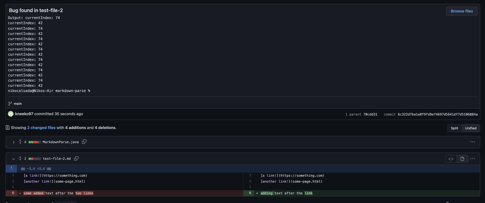
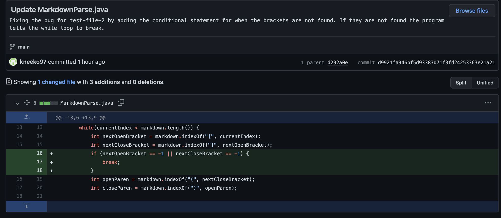
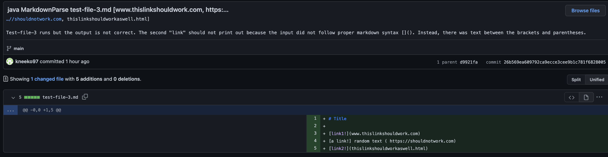
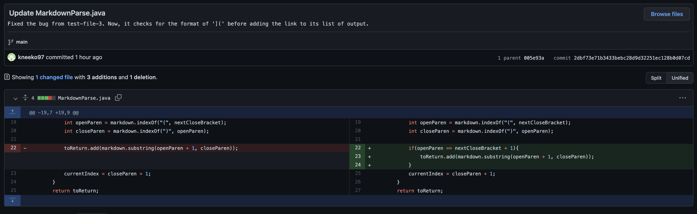
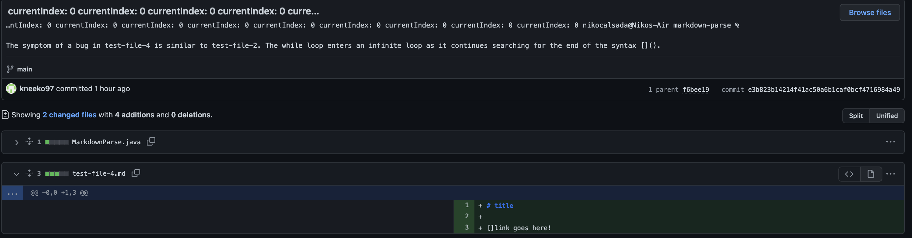
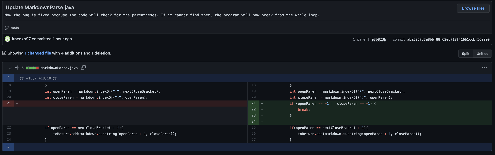

# Week 4: Lab Report 1

## Bug 1:

[Bug 1 - test file](https://github.com/kneeko97/markdown-parse/blob/main/test-file-2.md)

## Bug 2: 

[Bug 2 - test file](https://github.com/kneeko97/markdown-parse/blob/main/test-file-3.md)

## Bug 3: 

[Bug 3 - test file](https://github.com/kneeko97/markdown-parse/blob/main/test-file-4.md)

